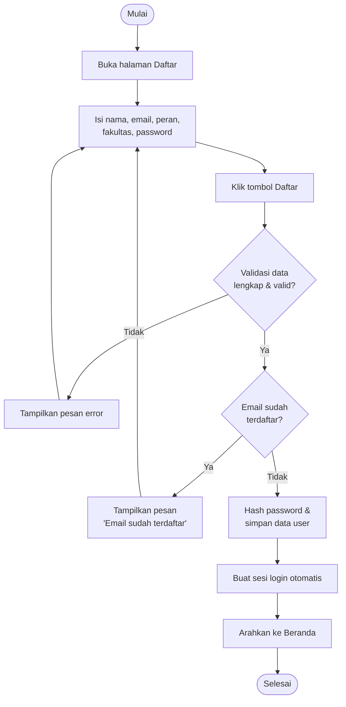
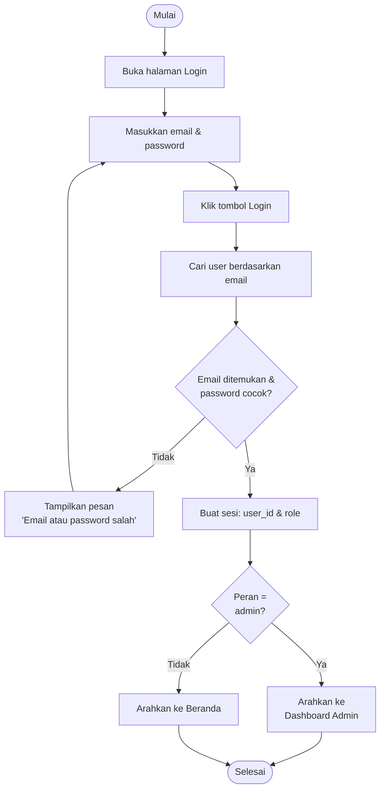
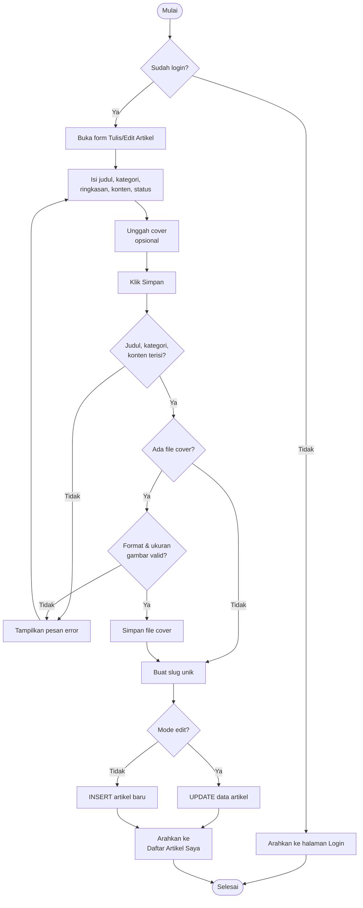
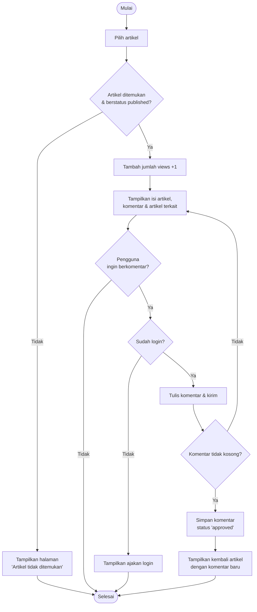
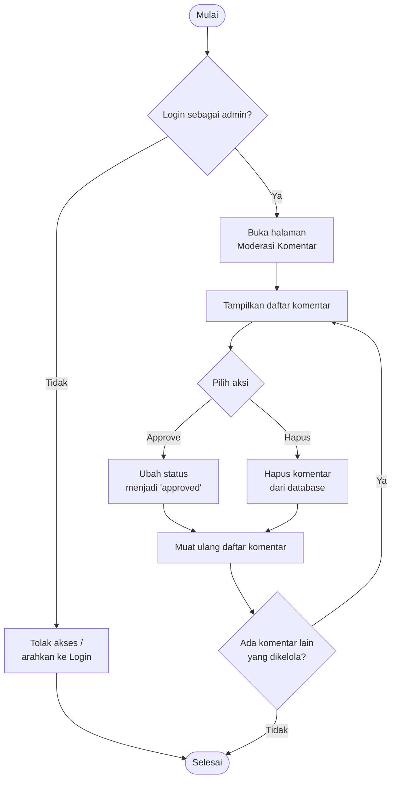
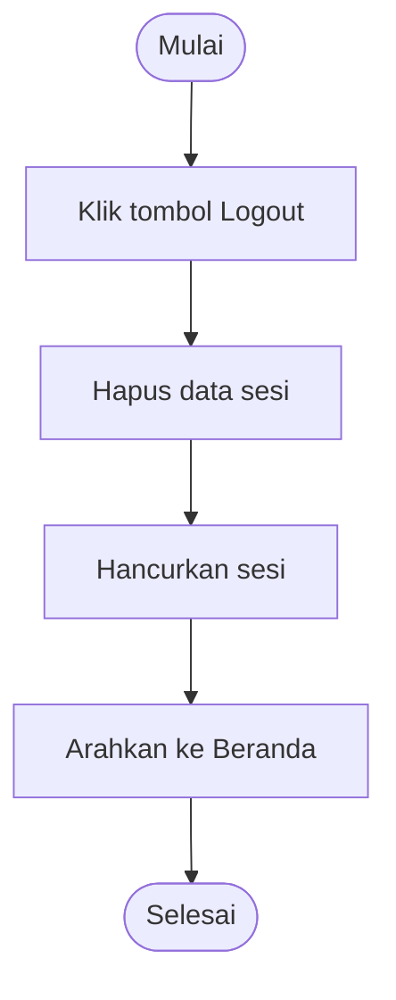

# BAB ... ACTIVITY DIAGRAM

## 1. Pengertian Activity Diagram

Activity diagram merupakan salah satu diagram dalam *Unified Modeling Language* (UML)
yang digunakan untuk menggambarkan alur kerja (*workflow*) atau aliran aktivitas dari
sebuah proses pada sistem. Activity diagram menggambarkan rangkaian aktivitas yang
terjadi mulai dari titik awal (*initial node*), urutan aktivitas, percabangan keputusan
(*decision*), hingga titik akhir (*final node*). Berbeda dengan use case diagram yang
menggambarkan *apa* yang dapat dilakukan sistem, activity diagram menggambarkan
*bagaimana* alur sebuah proses berjalan langkah demi langkah.

Pada perancangan aplikasi **UNSRAT Community Blog**, activity diagram digunakan untuk
memodelkan alur setiap proses utama yang melibatkan pengguna (mahasiswa/dosen) maupun
admin. Notasi yang digunakan dalam activity diagram pada bab ini adalah sebagai berikut:

| Simbol | Nama | Keterangan |
|--------|------|------------|
| ● (lingkaran penuh) | *Initial Node* | Menandakan titik awal aktivitas |
| Kotak sudut tumpul | *Action / Activity* | Menggambarkan satu aktivitas yang dikerjakan |
| ◇ (belah ketupat) | *Decision / Merge* | Percabangan atau penggabungan kondisi |
| Garis dengan panah | *Control Flow* | Arah aliran dari satu aktivitas ke aktivitas lain |
| Garis vertikal (*swimlane*) | *Partition* | Memisahkan aktivitas berdasarkan pelaku (aktor/sistem) |
| ◉ (lingkaran berbingkai) | *Final Node* | Menandakan titik akhir aktivitas |

Pada penggambaran berikut digunakan *swimlane* (partisi) untuk memisahkan aktivitas
yang dilakukan oleh **Pengguna/Admin** dengan aktivitas yang diproses oleh **Sistem**.

---

## 2. Activity Diagram Registrasi (Pendaftaran Akun)

Proses ini menggambarkan alur ketika pengunjung mendaftarkan akun baru sebagai dosen
atau mahasiswa. Sistem memvalidasi data masukan, memeriksa keunikan email, kemudian
menyimpan akun dan langsung membuat sesi login.

**Penjelasan:** Sistem memvalidasi kelengkapan data (nama wajib diisi, format email
valid, password minimal 6 karakter, dan peran harus dosen/mahasiswa). Apabila valid,
sistem memeriksa apakah email sudah pernah terdaftar. Jika belum, password dienkripsi
menggunakan `password_hash()` lalu data disimpan ke tabel `users`, dan pengguna langsung
masuk ke sesi login.

---

## 3. Activity Diagram Login

Proses login menggambarkan alur autentikasi pengguna. Sistem mencocokkan email dan
password, kemudian mengarahkan pengguna sesuai perannya (admin diarahkan ke dasbor
admin, pengguna biasa ke beranda).

**Penjelasan:** Sistem memverifikasi password menggunakan `password_verify()`. Jika
kredensial benar, sistem menyimpan `user_id` dan `role` ke dalam sesi, lalu melakukan
pengalihan halaman (*redirect*) sesuai peran pengguna.

---

## 4. Activity Diagram Menulis / Mengelola Artikel

Diagram ini menggambarkan alur ketika pengguna (dosen/mahasiswa) yang sudah login
membuat atau memperbarui artikel. Termasuk di dalamnya validasi input, proses unggah
gambar sampul (*cover*) yang bersifat opsional, dan pembuatan *slug* unik.

**Penjelasan:** Sistem memastikan pengguna telah login (`require_login()`). Field judul,
kategori, dan konten wajib diisi. Jika pengguna mengunggah cover, sistem memvalidasi
format (JPG/PNG/WEBP) dan ukuran (maksimal 2 MB). Sistem kemudian membuat *slug* unik
dari judul. Bila artikel sedang diedit, data diperbarui (`UPDATE`); bila artikel baru,
data ditambahkan (`INSERT`) ke tabel `articles`.

---

## 5. Activity Diagram Membaca Artikel & Menambah Komentar

Diagram berikut menggabungkan dua alur yang terjadi pada halaman detail artikel:
membaca artikel (yang menambah jumlah pembaca) dan mengirim komentar (khusus pengguna
yang sudah login).

**Penjelasan:** Ketika sebuah artikel dibuka, sistem menambah kolom `views` sebanyak
satu. Form komentar hanya ditampilkan kepada pengguna yang sudah login; pengunjung yang
belum login diarahkan untuk login terlebih dahulu. Komentar yang dikirim disimpan ke
tabel `comments` dan langsung berstatus *approved* sehingga tampil di halaman.

---

## 6. Activity Diagram Moderasi Komentar (Admin)

Diagram ini menggambarkan alur admin dalam mengelola komentar pengguna, yaitu menyetujui
komentar yang masih *pending* atau menghapus komentar.

**Penjelasan:** Halaman ini dilindungi oleh `require_admin()` sehingga hanya dapat
diakses oleh admin. Admin dapat menyetujui (*approve*) komentar berstatus *pending* atau
menghapus komentar. Setiap aksi memperbarui data pada tabel `comments` lalu daftar
komentar dimuat ulang.

---

## 7. Activity Diagram Logout

**Penjelasan:** Saat pengguna logout, sistem menghapus seluruh data sesi dan
menghancurkan sesi (`session_destroy()`), kemudian mengarahkan pengguna kembali ke
halaman beranda sebagai pengunjung biasa.

---

> **Catatan:** Diagram di atas ditulis menggunakan sintaks **Mermaid** sehingga dapat
> langsung dirender di editor yang mendukung Mermaid (mis. VS Code dengan ekstensi
> Markdown Preview Mermaid, atau GitHub). Untuk laporan akhir, diagram dapat diekspor
> menjadi gambar (PNG/SVG) melalui [mermaid.live](https://mermaid.live) lalu disisipkan
> ke dokumen Word.
